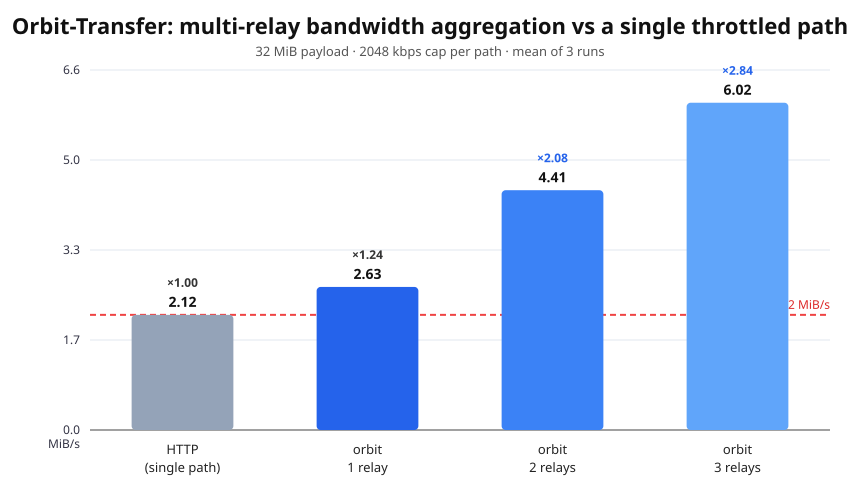

# Orbit-Transfer — show & tell

**Hybrid P2P / edge-relay file transfer with rateless fountain codes**
(LT + LDPC + RaptorQ-style HDPC precoding), compiled to WASM, running in the
browser, with multi-path bandwidth aggregation.

## Live demo

- **WebRTC share-link transfer (automated signaling):** https://orbit-transfer-theta.vercel.app/webrtc/
  Drag & drop a file, share a `?room=` link, transfer P2P over a WebRTC data
  channel. Slide the simulated-loss to 40% — it still decodes at ~1× overhead.
- **Fountain codec in the browser:** https://dylan245-droid.github.io/orbit-transfer/demo/
- Static (no-server, manual SDP) copy: https://dylan245-droid.github.io/orbit-transfer/webrtc/

## What it does

Orbit-Transfer splits a file into `K` source symbols, adds `S` LDPC and `H`
RaptorQ-style HDPC precode checks, and the sender emits an *unbounded* stream of
encoded symbols. The receiver reconstructs the file from any `K + ε` distinct
symbols — no retransmission requests, no fixed overhead, order-independent.
Symbols are interchangeable, so a round-robin scheduler fans them out over `N`
relays (and optionally a direct TCP/QUIC P2P channel), and the aggregate
throughput is the sum of the live paths. A dead path is just skipped.

## Why it's neat

- **Rateless by construction** — overhead adapts to actual loss, no ACK loop.
- **Multi-path aggregation falls out for free** — no MPTCP-style congestion
  coupling; the code absorbs path-to-path rate differences.
- **Browser-native** — the whole codec runs in WASM over a WebRTC data channel.
- **Zero infrastructure** for same-machine two-tab demos; a tiny room server
  for cross-machine signaling.

## Benchmark (reproducible)

`node bench/run-bench.mjs` — 32 MiB payload, each path capped at 2048 kbps
(token-bucket, same self-correcting limiter from the paper):

```
Case      MiB/s    Factor vs HTTP
http      2.12     1.00×   (single throttled path)
orbit-1   2.63     1.24×   (one throttled relay)
orbit-2   4.41     2.08×
orbit-3   6.02     2.84×
```



N rate-limited paths → ≈ N× throughput, linear.

## Ships

- **npm:** `orbit-transfer-wasm` — encode/decode any file in the browser
  (TypeScript + WASM).
- **Docker:** `dylanondo/orbit-relay` — one binary edge relay, ~78 MB.
- **Code + paper (EN & FR):** https://github.com/Dylan245-droid/orbit-transfer
  — IEEEtran paper with the full design, the aggregation study, and a rate
  limiter fix (CPU-spinning token buckets collapse under concurrency;
  parked-sleep + self-correcting credit keeps N relays perfectly uniform).

## Reproduce

```sh
cargo build --release -p orbit-cli -p orbit-relay
node bench/run-bench.mjs 2048 32 3    # table + bench.csv
node bench/chart.mjs                   # chart.svg
```

Two tabs, same machine:

```sh
cd crates/orbit-wasm/ts && npm install && npm run build
cd ../webrtc && node serve.mjs         # http://127.0.0.1:8787/webrtc/
```